# 🎓 Digitally Validate a University Degree

A Rust-based CLI application to issue, present, and verify academic credentials using [IOTA Identity Framework](https://docs.iota.org/iota-identity). This project demonstrates how to create and validate Verifiable Credentials (VCs) and Verifiable Presentations (VPs) using the IOTA Identity framework — entirely through the command line.

---

## 📦 Requirements

Before you begin, make sure you have:

- Rust installed (stable)
- Setup a local IOTA node and request test tokens from faucet

:::info
The holder and issuer will publish their DIDs to this local network, so it must be running first. See how to set up a local [IOTA Network](https://docs.iota.org/developer/iota-identity/getting-started/local-network-setup)
:::

- Deploy the IOTA [identity contract](https://github.com/iotaledger/identity) to your local node. See how to do this [here](https://docs.iota.org/developer/iota-identity/getting-started/local-network-setup#publish-the-iota-identity-package)

```mermaid
sequenceDiagram
    participant Alice as Holder (Alice)
    participant University as Issuer (University)
    participant Verifier as Verifier (IOTA Foundation)
    Alice->>Alice: Step 1️⃣ Create DID (holder_doc.json)
    University->>University: Step 2️⃣ Create DID (issuer_doc.json)
    University->>University: Create VC & sign as JWT (vc.jwt)
    University-->>Alice: Send VC JWT
    Alice->>Alice: Step 3️⃣ Create VP containing VC & sign as JWT (vp.jwt)
    Alice-->>Verifier: Send VP JWT
    Verifier->>Verifier: Step 4️⃣ Resolve holder & issuer DIDs
    Verifier->>Verifier: Validate VP + VC signatures & challenge
    Verifier-->>Verifier: 🎉 All credentials valid
```



## 🚀 Features

- ✅ **DID Creation** for issuer and holder identities
- 📜 **Issue creates Verifiable Credential** in JWT format
- 🧾 **Holder create and Sign Verifiable Presentations**
- 🔍 **Vrifierr Validate Presentations and Credentials**

---

## 📦 Installation

1. **Clone this repository:**

```bash
git clone git clone https://github.com/iota-community/digitally-validate-a-degree.git
cd digitally_validate_degree
```

2. **Install dependencies**

```bash
cargo build
```

**Step 1: Holder creates their DID**

```bash
IOTA_IDENTITY_PKG_ID=your-package-id cargo run --bin holder
```

This will:

- Generates a new Decentralized Identifier (DID) for the holder (Alice)
- Publishes the DID Document to the local IOTA network (anchored on-chain)
- Generates & saves a fragment (private key reference) in holder_fragment.txt — used later to sign the VP

**Step 2: Issuer creates their DID and Verifiable Credential (VC)**

Run the following to simulate the university issuing a VC:

```bash
IOTA_IDENTITY_PKG_ID=your-package-id cargo run --bin issuer
```

This will:

- Generates a new DID for the Issuer (e.g., University of Oslo)
- Publishes the Issuer’s DID Document on the local IOTA network
- Creates a Verifiable Credential (VC) for Alice (e.g., degree, GPA)
- Signs the VC as a JWT so it can later be presented and verified
- Print the VC JWT (copy this for the next step)

**Step 3: Holder Creates a Verifiable Presentation (VP)**

Alice receives the VC and creates a VP to send to the IOTA Foundation.

```bash
IOTA_IDENTITY_PKG_ID=your-package-id cargo run --bin holder -- --vc "<PASTE_VC_JWT_HERE>"
```

This will:

- Takes the VC JWT issued by the university
- Wraps it into a Verifiable Presentation (VP)
- Signs the VP with Alice’s DID & includes a challenge (to prevent replay attacks)
- Saves the resulting VP JWT as vp.jwt
- Print the VP JWT

**Step 4: Verifier Validates the Verifiable Presentation**

The IOTA Foundation (verifier) now checks the authenticity and validity of the VP.

```bash
IOTA_IDENTITY_PKG_ID=your-package-id cargo run --bin verifier "<PASTE_VP_JWT_HERE>"
```

This will:

- Extracts holder’s DID and issuer’s DID from the VP JWT
- Resolves both DID Documents from the local IOTA network
- Verifies the VP JWT signature and checks the challenge matches
- Validates the embedded VC inside the VP to ensure it was really issued by the trusted issuer

If successful, you’ll see:

```bash
🎉 All credentials in the VP are valid!
```